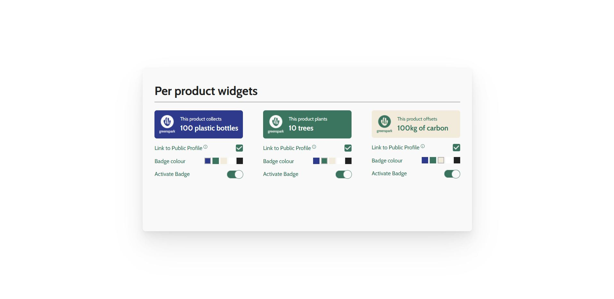

# Greenspark REST API
Welcome to my solution to Greenspark full stack coding challenge!

## Tech Stack

### Front End
* Typescript
* React

### Back End
* Node.js with Express
* MongoDB Atlas with Mongoose

## How to use it
* Fork this repository and clone it on your local machine. Run `npm install` in the root folder, and also in `/server` and `/client` to install all the dependencies.
* You will need to create a `.env` file in `/server` with the environment variable `MONGODB_URI=`.
* You can paste there the uri to your MongoDB Atlas database, or ask the author for the uri of the original database.
* You can now start the server. If nodemon is globally installed on your computer, run `nodemon index.js` from `/server`. It will run on port 3001.
* Move to `/client` and initialize the React app with `npm start`.
* If you used the original database, you will see a small UI with 3 widgets. If you didn't, you will see an empty UI. You can then populate the database by running `node seeds.js` from `/server` and refresh your browser.
* You should now see three plugins that you can manipulate. Check their box, change their colour or toggle them on and off. Each of these changes will persist in the database. This way your plugin configuration will still be there if you exit the application and enter again, or if you refresh the browser.

## What have I done?
I have tried to reproduce the provided Figma UI with precision, not only in style but also in functionality. As such, the application allows any user to make changes in the configuration of their widgets. The backend allows that configuration to persist. In this simplified version of the application, though, the user cannot create new widgets or delete the existing ones, since the UI doesn't provide for a section where to implement such functionality.

However, I have created the necessary endpoints in the back end. If wanted, new widgets can be created or deleted by sending HTTP requests via Postman, or similar. To create a new widget, the body of the POST request should look like:

`
{
    "type": "carbon",
    "description": "100kg of carbon",
    "color": "var(--beige)",
    "active": false,
    "links": false
}
`

* Admitted types are `"carbon", "trees"` and `"bottles"`. 
* Admitted colours are `"var(--blue)", "var(--green)", "var(--beige)", "var(--white)"` and `"var(--black)"`.

To delete an existing widget, the body of the DELETE request should include its id, in a way such as this:

`{
    "id": "625a97fdfa6fbbf373783889"
}`

I have chosen MongoDB over other kinds of database, to get as close as possible to the tech stack used at GreenSpark. I have chosen MongoDB Atlas service to facilitate the task of running the application in a different computer than mine.